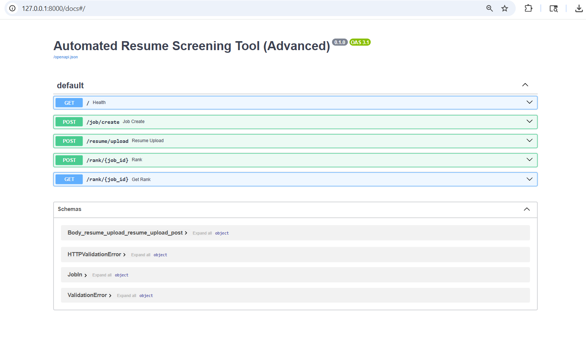
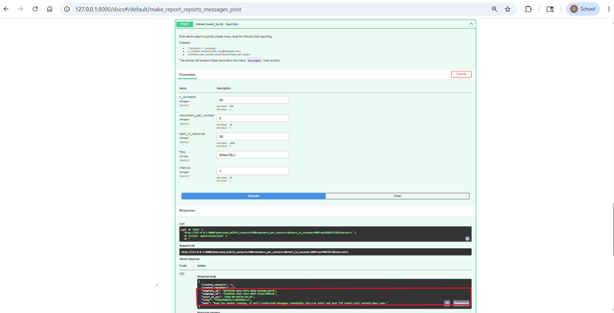
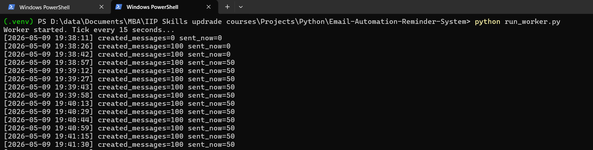
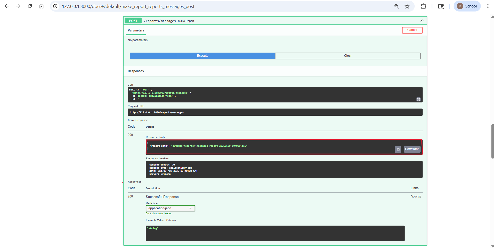
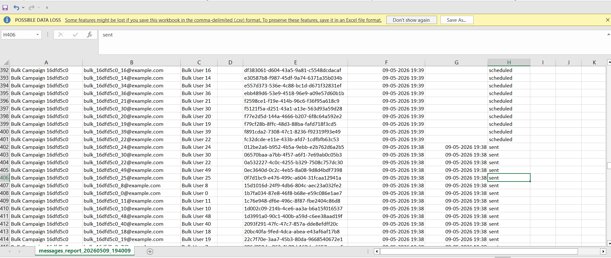

# Email Automation & Reminder System 

A MySQL-backed email automation system that schedules reminders, expands recurring rules (RRULE) into due messages, and processes them via a background worker. Includes reporting to CSV and a bulk seeding mode to generate “industry-scale” data for testing.

> Demo Video: https://drive.google.com/file/d/1S-mZl321NvTZcSLWSIW7rwRrQYfZBW0g/view?usp=drive_link


---

## Features

- **Contacts, Templates, Campaigns** stored in **MySQL**
- **Reminders**:
  - One-time reminders (single `start_at_utc`)
  - Recurring reminders using **RRULE** (`FREQ=MINUTELY`, etc.)
- **Scheduler** expands reminders into rows in `messages`
- **Worker** runs every 15 seconds:
  - creates messages due soon
  - dispatches due messages in batches (rate-limited)
- **Safety controls**:
  - `DRY_RUN=true` to prevent real email sending
  - `ALLOWED_RECIPIENT_DOMAIN=example.com` allowlist guard
- **Reporting**: export messages to CSV (`/reports/messages`)
- **Bulk demo seed**: generate lots of data for reporting (e.g., 700+ rows)

---

## Tech Stack

- Python, FastAPI (Swagger UI at `/docs`)
- SQLAlchemy + PyMySQL
- MySQL
- Jinja2 templates (for email subject/body rendering)

---

## Project Structure (typical)

- `api/app.py` – FastAPI routes (CRUD + demo seed endpoints)
- `src/` – DB session, scheduler, renderer, mailer, report generator, config
- `run_worker.py` – background worker (tick loop)
- `db/schema.sql` – database schema
- `outputs/reports/` – generated CSV reports (usually ignored)

---

## Setup (Local)

### 1) Create virtualenv + install dependencies

```bash
python -m venv .venv
# Windows:
.venv\Scripts\activate
# macOS/Linux:
source .venv/bin/activate

pip install -r requirements.txt
```

### 2) Create database + tables

Create a MySQL database (example: `email_automation`), then run:

- `db/schema.sql`

You can run it via MySQL Workbench or CLI:

```sql
SOURCE path/to/db/schema.sql;
```

### 3) Configure environment variables

Create a `.env` file (do **not** commit it). Use `.env.example` as a template.

Minimum required:

- DB connection settings (host/user/pass/name)
- Safety:
  - `DRY_RUN=true`
  - `ALLOWED_RECIPIENT_DOMAIN=example.com`

Example:

```env
DB_HOST=127.0.0.1
DB_PORT=3306
DB_NAME=email_automation
DB_USER=root
DB_PASS=your_password

DRY_RUN=true
ALLOWED_RECIPIENT_DOMAIN=example.com
```

> Notes:
> - Keep `DRY_RUN=true` for demos.
> - Use `@example.com` addresses for bulk seeding so the allowlist matches.

---

## Run

Open two terminals.

### Terminal 1: API

```bash
uvicorn api.app:app --reload
```

API docs:
- http://127.0.0.1:8000/docs

### Terminal 2: Worker

```bash
python run_worker.py
```

The worker prints tick logs (every ~15 seconds), e.g.
- `created_messages=... sent_now=...`

---

## Demo Workflow (Video Script)

In Swagger UI (`/docs`):

1. `POST /demo/seed_bulk`
   - Example parameters:
     - `n_contacts=50`
     - `reminders_per_contact=2`
     - `start_in_seconds=30`
     - `freq=MINUTELY`
     - `interval=1`
2. Watch worker output for batch processing (`sent_now=50`).
3. `GET /messages?limit=200` to confirm many `sent` rows.
4. `POST /reports/messages` to generate a CSV file.
5. Open the CSV in Excel/Sheets (you should see large row counts, e.g. 700+).

---

## API Endpoints (high level)

- `POST /contacts` – create contact
- `POST /templates` – create template
- `POST /campaigns` – create campaign
- `POST /reminders` – create reminder (one-time or recurring)
- `GET /messages` – list recent messages
- `POST /reports/messages` – export messages report to CSV
- `POST /demo/seed` – single demo seed (unique email/name each time)
- `POST /demo/seed_bulk` – bulk seed to generate large datasets

---

## Common Issues

### 1) MySQL Workbench Error 1175 (Safe Updates) while deleting test data
Temporarily disable safe updates:

```sql
SET SQL_SAFE_UPDATES = 0;

USE email_automation;
DELETE FROM messages;
DELETE FROM reminders;
DELETE FROM campaigns;
DELETE FROM templates;
DELETE FROM contacts;

SET SQL_SAFE_UPDATES = 1;
```

### 2) Jinja template errors (“UndefinedError … is undefined”)
If you add new placeholders like `{{ demo_id }}`, make sure your render context includes them in the worker, or remove the placeholder.

---

## Screenshots / Evidence
- 
- 
- 
- 
- 
- 

---

## Author
Debarati